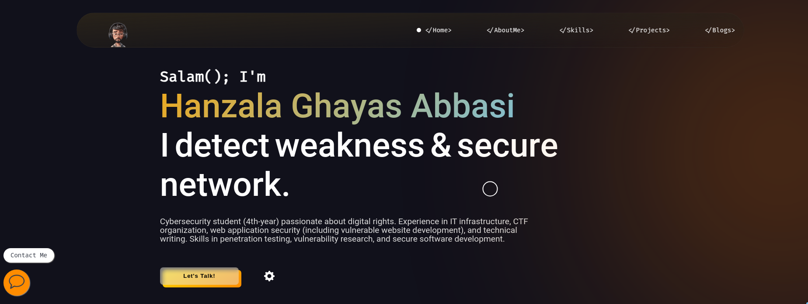

# Hanzala Ghayas Abbasi – Cybersecurity Portfolio



## About Me

I am Hanzala Ghayas Abbasi, a cybersecurity professional with a strong interest in digital rights and secure technology development. My work spans IT infrastructure, web application security, CTF event organization, and technical writing.

I specialize in:

- Penetration testing  
- Vulnerability research  
- Secure software development  

I hold the **Practical Network Penetration Tester (PNPT)** certification, along with other credentials in network security, OSINT, privilege escalation, and ethical hacking. I actively participate in and contribute to the infosec community through CTFs, mentorship, and content creation.

Currently, I am open to collaborations focused on practical cybersecurity improvements and advocating for a safer digital environment.

---

## Key Features

- **Responsive design** for desktop and mobile  
- **Interactive UI** with animations and parallax effects  
- **Accessibility support** including ARIA labels and keyboard navigation  
- **Modern aesthetic** with smooth transitions  
- **SEO optimized** using meta tags and structured data  

---

## Website Sections

- **Home**: Landing page with animation and contact link  
- **About**: My background and journey in cybersecurity  
- **Skills**: Tools and technologies I use regularly  
- **Projects**: CTF write-ups, labs, and security demonstrations  
- **Blogs**: Technical articles and cybersecurity walkthroughs  
- **Settings**: Toggle sound and visual preferences  


## Technologies Used

### Frontend

- HTML5, CSS3 (with custom animations and responsive layout)  
- JavaScript for interactivity  
- AOS (Animate On Scroll)  
- Google Fonts  

### Cybersecurity Tools

- Nmap, Burp Suite, Metasploit, Wireshark  
- Kali Linux, OWASP ZAP, SQLMap  
- Python, Maltego, John the Ripper, Hashcat  
- Nessus  

### Deployment

- GitHub Pages  
- SEO enhancements with JSON-LD structured data  

---

## Installation

Clone the repository:

```bash
git clone https://github.com/hanzalaghayasabbasi/Portfolio.git
cd Portfolio-main
```
## 💻 How to Use

To view the site:

- Open `index.html` directly in your browser  
**or**

- Run a local development server:

```bash
python3 -m http.server

```
## 📁 Project Structure
```bash

Portfolio-main/
├── .github/                         # GitHub-specific settings and workflows
├── src/                             # Assets used across the site
│   ├── mp3/                         # Audio files
│   ├── png/                         # PNG images (e.g., logos, previews)
│   ├── svg/                         # SVG icons (e.g., social icons, skill logos)
│   ├── webp/                        # Optimized image formats
│   ├── pdf/                         # Resume and supporting documents
├── CNAME                            # Custom domain configuration for GitHub Pages
├── README.md                        # Documentation and usage instructions (this file)
├── click.png                        # Custom cursor click effect
├── cursorr.png                      # Custom default cursor
├── index.html                       # Main homepage of the portfolio
├── linkCard.html                    # Interactive cards page linking to blog posts, tools, and CTF write-ups
├── main.js                          # Handles menu toggle, animations, and interactivity
├── professional-image-parallax.js   # Implements parallax scrolling effect
├── style.css                        # Custom styling for layout, animations, and theme


```

## 📸 Live Demo  
👉 Visit the interactive website: [](https://hanzalaghayasabbasi.com)


---

## 📬 Contact

[](mailto:hanzala.portfolio@gmail.com)
[](https://www.linkedin.com/in/hanzalaghayasabbasi)
[](https://github.com/hanzalaghayasabbasi)
[](https://medium.com/@hanzalaghayasabbasi01)


